# RaFlow 实时语音转写系统详细设计文档

## 1. 文档概述

本文档基于 [0001-spec.md](./0001-spec.md) 技术架构报告，提供详细的系统设计方案。本设计采用 Tauri v2 框架与 ElevenLabs Scribe v2 Realtime API 构建桌面级实时听写工具。

### 1.1 版本信息

| 组件 | 版本 | 来源 |
|------|------|------|
| Tauri Core | 2.9.5 | [crates.io](https://crates.io/crates/tauri) |
| Tauri CLI | 2.9.6 | [Tauri Release](https://v2.tauri.app/release/) |
| cpal | 0.15.3 / 0.16.0 | [crates.io](https://crates.io/crates/cpal) |
| tokio-tungstenite | 0.28.0 | [crates.io](https://crates.io/crates/tokio-tungstenite) |
| rubato | 0.16.2 | [crates.io](https://crates.io/crates/rubato) |
| enigo | 0.6.1 | [crates.io](https://crates.io/crates/enigo) |
| tauri-plugin-global-shortcut | 2.3.0 | [crates.io](https://crates.io/crates/tauri-plugin-global-shortcut) |
| tauri-plugin-clipboard-manager | 2.3.2 | [crates.io](https://crates.io/crates/tauri-plugin-clipboard-manager) |
| x-win | 5.3.3 | [crates.io](https://crates.io/crates/x-win) |

---

## 2. 系统架构

### 2.1 整体架构图

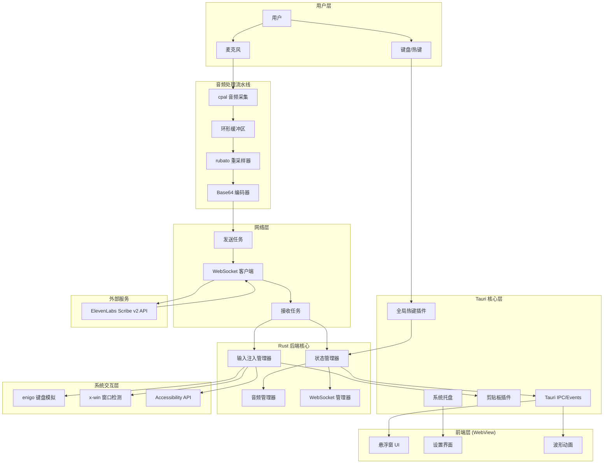

### 2.2 分层架构说明

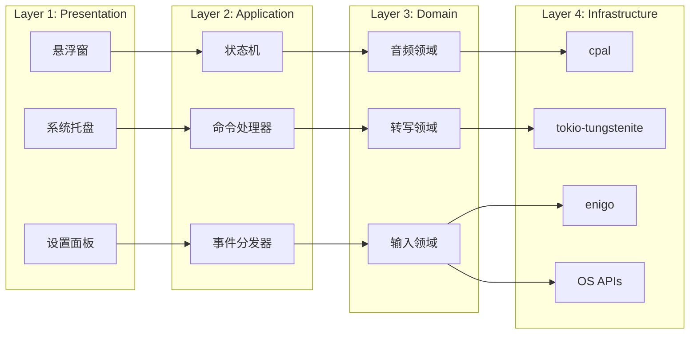

---

## 3. 核心组件设计

### 3.1 状态机设计

系统采用有限状态机管理应用生命周期：

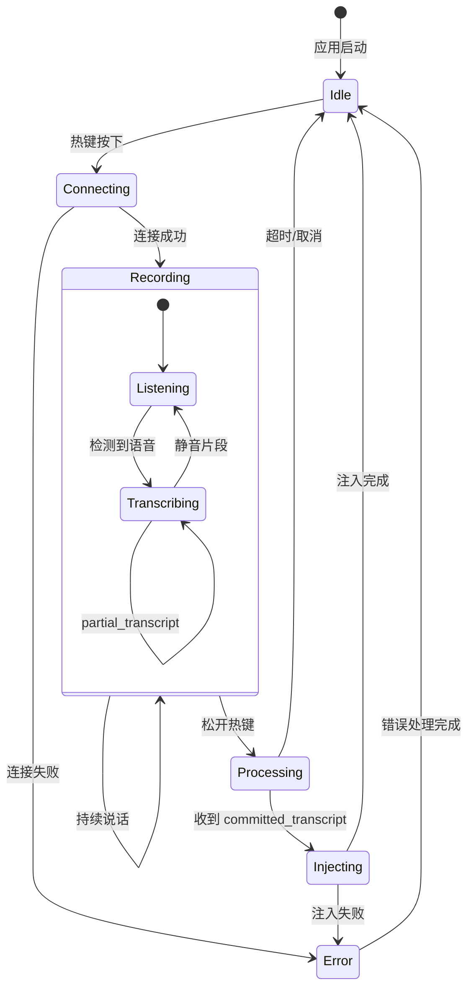

### 3.2 状态定义

```rust
/// 应用主状态
#[derive(Debug, Clone, PartialEq)]
pub enum AppState {
    /// 空闲状态，等待用户触发
    Idle,
    /// 正在建立 WebSocket 连接
    Connecting,
    /// 正在录音和转写
    Recording(RecordingState),
    /// 正在处理最终转写结果
    Processing,
    /// 正在将文本注入目标应用
    Injecting,
    /// 错误状态
    Error(AppError),
}

/// 录音子状态
#[derive(Debug, Clone, PartialEq)]
pub enum RecordingState {
    /// 监听中，未检测到语音
    Listening,
    /// 正在转写
    Transcribing {
        partial_text: String,
        confidence: f32,
    },
}
```

---

## 4. 音频处理流水线

### 4.1 音频数据流

```mermaid
flowchart LR
    subgraph "采集阶段"
        A1[麦克风] -->|原始 PCM| A2[cpal Stream]
        A2 -->|f32 @ 48kHz| A3[音频回调]
    end

    subgraph "缓冲阶段"
        A3 -->|最小拷贝| B1[Ring Buffer]
        B1 -->|批量读取| B2[处理队列]
    end

    subgraph "处理阶段"
        B2 -->|480 samples| C1[rubato 重采样]
        C1 -->|160 samples @ 16kHz| C2[f32 → i16 转换]
        C2 -->|PCM bytes| C3[Base64 编码]
    end

    subgraph "传输阶段"
        C3 -->|JSON 封装| D1[mpsc Channel]
        D1 -->|async| D2[WebSocket Tx]
    end
```

### 4.2 重采样器设计

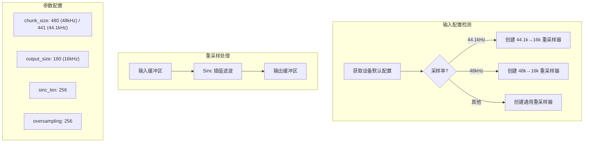

### 4.3 音频格式转换

```rust
/// 音频格式配置
pub struct AudioConfig {
    /// 输入采样率（设备原生）
    pub input_sample_rate: u32,
    /// 输出采样率（API 要求）
    pub output_sample_rate: u32,  // 固定 16000
    /// 通道数
    pub channels: u16,  // 固定 1 (mono)
    /// 每次处理的帧数
    pub frames_per_buffer: usize,
}

/// 支持的输入采样率到 16kHz 的转换比例
/// 48000 → 16000: 3:1
/// 44100 → 16000: 2.75625:1
/// 32000 → 16000: 2:1
/// 16000 → 16000: 1:1 (直通)
```

---

## 5. WebSocket 通信协议

### 5.1 连接流程

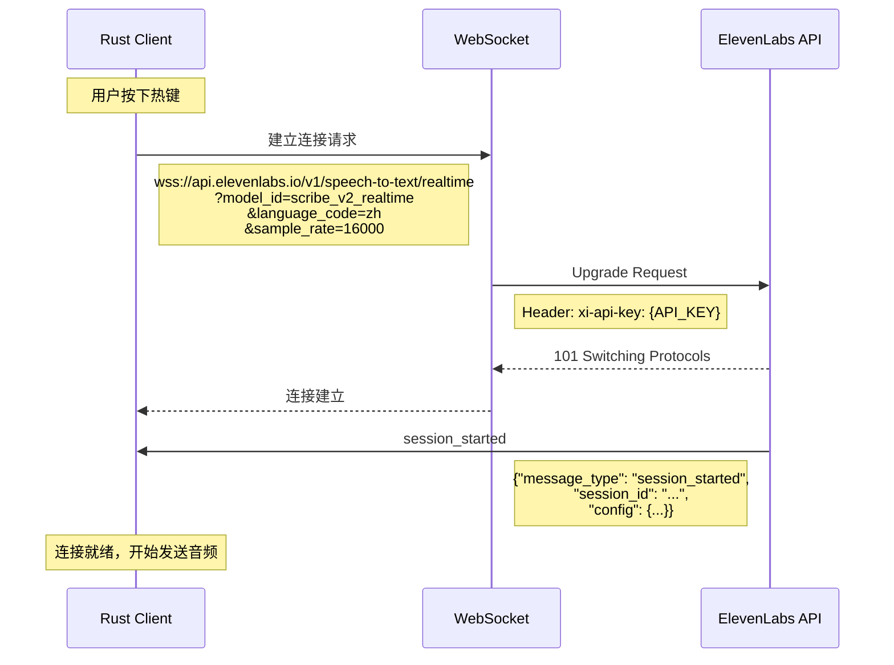

### 5.2 数据交换流程

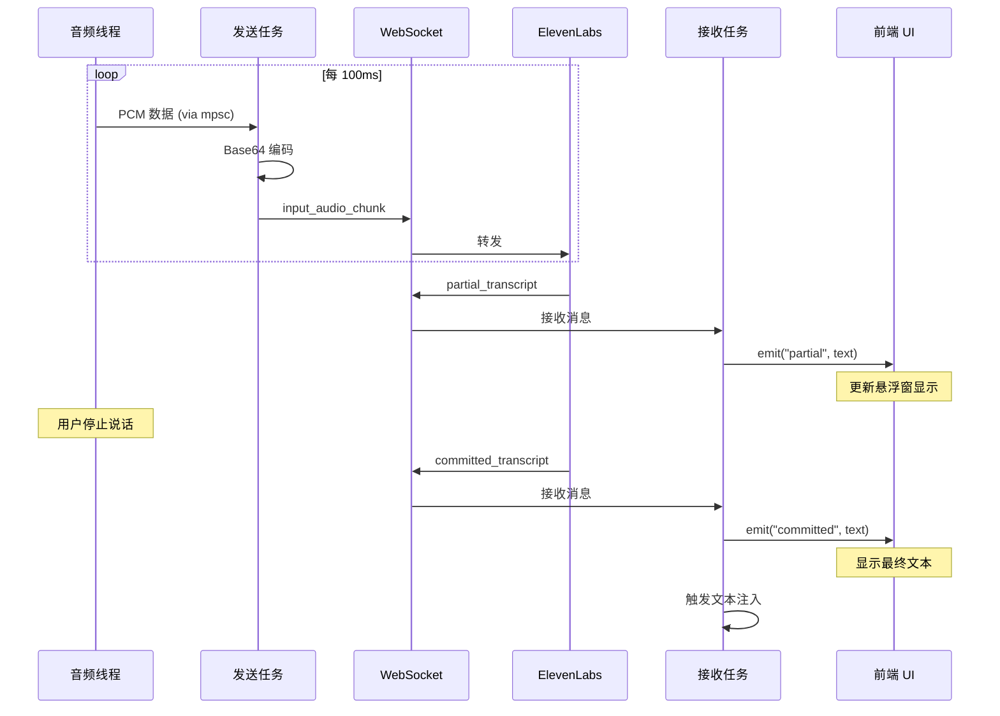

### 5.3 消息格式定义

#### 5.3.1 客户端发送消息 (Client → Server)

```rust
/// 音频块消息
#[derive(Serialize)]
pub struct InputAudioChunk {
    /// 消息类型，固定为 "input_audio_chunk"
    pub message_type: &'static str,
    /// Base64 编码的 PCM 音频数据
    pub audio_base_64: String,
    /// 是否手动提交此段
    #[serde(skip_serializing_if = "Option::is_none")]
    pub commit: Option<bool>,
    /// 采样率（首次发送时指定）
    #[serde(skip_serializing_if = "Option::is_none")]
    pub sample_rate: Option<u32>,
    /// 上下文文本（仅首次发送）
    #[serde(skip_serializing_if = "Option::is_none")]
    pub previous_text: Option<String>,
}

/// 手动提交消息
#[derive(Serialize)]
pub struct CommitMessage {
    pub message_type: &'static str,  // "commit"
}

/// 关闭消息
#[derive(Serialize)]
pub struct CloseMessage {
    pub message_type: &'static str,  // "close"
}
```

#### 5.3.2 服务端响应消息 (Server → Client)

```rust
/// 服务端消息（使用 tagged enum）
#[derive(Deserialize)]
#[serde(tag = "message_type")]
pub enum ServerMessage {
    /// 会话开始
    #[serde(rename = "session_started")]
    SessionStarted {
        session_id: String,
        config: SessionConfig,
    },

    /// 部分转写（实时更新）
    #[serde(rename = "partial_transcript")]
    PartialTranscript {
        text: String,
    },

    /// 最终转写（已提交）
    #[serde(rename = "committed_transcript")]
    CommittedTranscript {
        text: String,
    },

    /// 带时间戳的转写
    #[serde(rename = "committed_transcript_with_timestamps")]
    CommittedTranscriptWithTimestamps {
        text: String,
        language_code: String,
        words: Vec<WordTimestamp>,
    },

    /// 输入错误
    #[serde(rename = "input_error")]
    InputError {
        error_message: String,
    },
}

/// 会话配置
#[derive(Deserialize)]
pub struct SessionConfig {
    pub sample_rate: u32,
    pub audio_format: String,
    pub language_code: Option<String>,
    pub model_id: String,
    pub vad_commit_strategy: Option<VadConfig>,
}

/// 单词时间戳
#[derive(Deserialize)]
pub struct WordTimestamp {
    pub word: String,
    pub start: f64,
    pub end: f64,
    pub r#type: String,
    pub logprob: Option<f64>,
}
```

### 5.4 连接参数

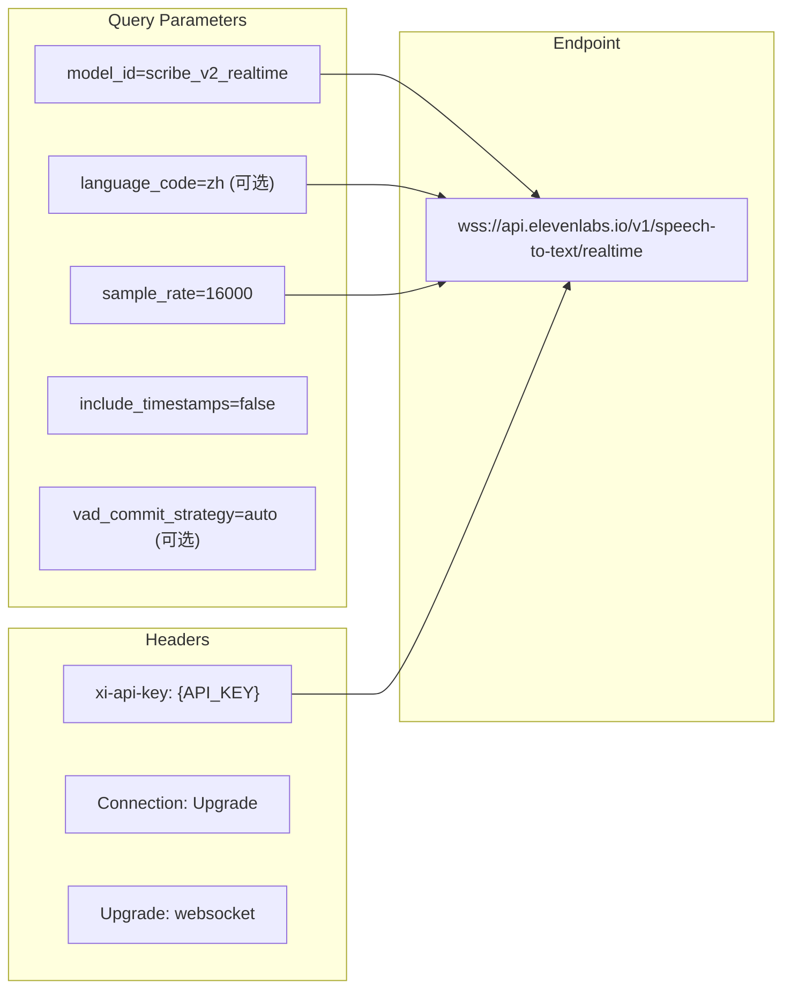

---

## 6. 文本注入系统

### 6.1 注入策略决策流程

```mermaid
flowchart TB
    START[收到 committed_transcript] --> CHECK_LEN{文本长度}

    CHECK_LEN -->|< 10 字符| SHORT[短文本策略]
    CHECK_LEN -->|>= 10 字符| LONG[长文本策略]

    SHORT --> GET_FOCUS[获取焦点窗口]
    LONG --> GET_FOCUS

    GET_FOCUS --> CHECK_FOCUS{焦点有效?}

    CHECK_FOCUS -->|是| CHECK_EDITABLE{可编辑区域?}
    CHECK_FOCUS -->|否| CLIPBOARD_ONLY[仅复制到剪贴板]

    CHECK_EDITABLE -->|是| SELECT_STRATEGY{选择策略}
    CHECK_EDITABLE -->|否| CLIPBOARD_ONLY

    SELECT_STRATEGY -->|短文本| KEYBOARD[键盘模拟]
    SELECT_STRATEGY -->|长文本| PASTE[剪贴板粘贴]

    KEYBOARD --> ENIGO_TYPE[enigo.text()]

    PASTE --> SAVE_CLIP[保存当前剪贴板]
    SAVE_CLIP --> SET_CLIP[写入转写文本]
    SET_CLIP --> SEND_PASTE[发送 Cmd/Ctrl+V]
    SEND_PASTE --> DELAY[延时 100ms]
    DELAY --> RESTORE_CLIP[恢复剪贴板]

    ENIGO_TYPE --> DONE[完成]
    RESTORE_CLIP --> DONE
    CLIPBOARD_ONLY --> NOTIFY[通知用户]
    NOTIFY --> DONE
```

### 6.2 平台适配层

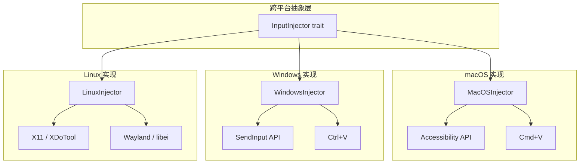

### 6.3 权限检查流程 (macOS)

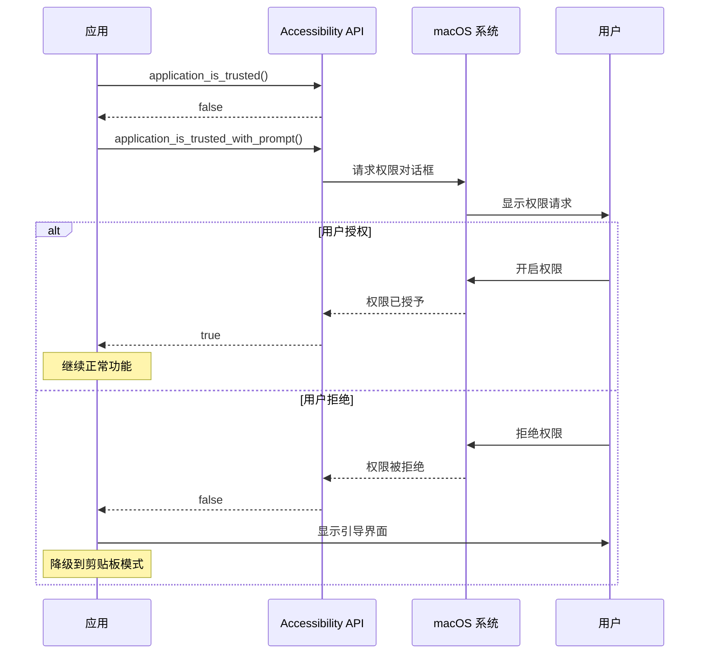

---

## 7. 全局热键系统

### 7.1 热键处理流程

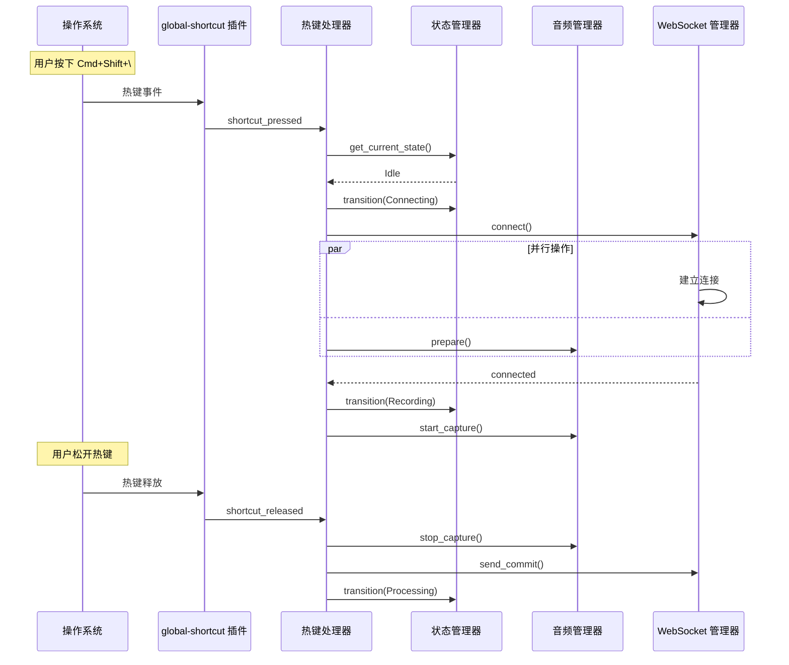

### 7.2 热键配置

```rust
/// 默认热键配置
pub struct HotkeyConfig {
    /// 主热键（Push-to-Talk）
    pub push_to_talk: String,  // "CommandOrControl+Shift+\\"

    /// 取消热键
    pub cancel: String,  // "Escape"

    /// 切换模式热键
    pub toggle_mode: Option<String>,  // "CommandOrControl+Shift+/"
}

/// 热键注册
pub fn register_shortcuts(app: &AppHandle, config: &HotkeyConfig) -> Result<()> {
    let shortcut_plugin = app.global_shortcut();

    // 注册 Push-to-Talk
    shortcut_plugin.on_shortcut(&config.push_to_talk, |app, shortcut, event| {
        match event.state {
            ShortcutState::Pressed => handle_ptt_pressed(app),
            ShortcutState::Released => handle_ptt_released(app),
        }
    })?;

    Ok(())
}
```

---

## 8. 前端界面设计

### 8.1 悬浮窗组件结构

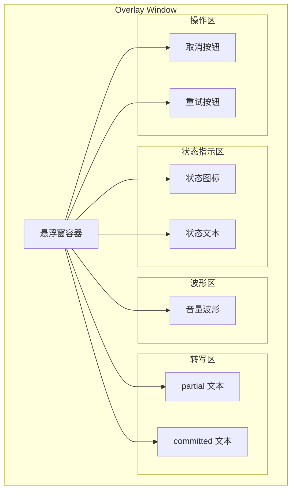

### 8.2 前后端事件通信

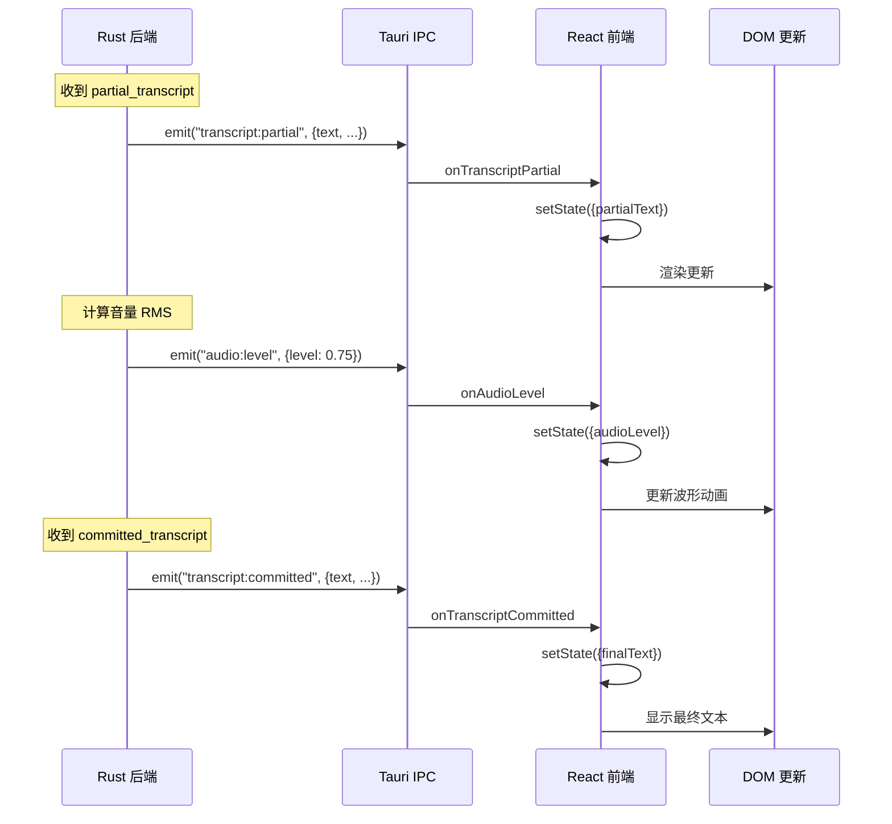

### 8.3 Tauri 窗口配置

```json
{
  "windows": [
    {
      "label": "main",
      "title": "RaFlow Settings",
      "width": 600,
      "height": 400,
      "visible": false,
      "center": true,
      "resizable": true
    },
    {
      "label": "overlay",
      "title": "",
      "width": 400,
      "height": 120,
      "decorations": false,
      "transparent": true,
      "alwaysOnTop": true,
      "skipTaskbar": true,
      "visible": false,
      "center": true,
      "focus": false
    }
  ]
}
```

---

## 9. 项目结构

### 9.1 目录结构

```
raflow/
├── src-tauri/
│   ├── Cargo.toml
│   ├── tauri.conf.json
│   ├── capabilities/
│   │   └── default.json
│   ├── icons/
│   └── src/
│       ├── lib.rs                 # Tauri 入口
│       ├── main.rs                # 程序入口
│       ├── commands/              # Tauri 命令
│       │   ├── mod.rs
│       │   ├── audio.rs
│       │   ├── transcription.rs
│       │   └── settings.rs
│       ├── audio/                 # 音频处理
│       │   ├── mod.rs
│       │   ├── capture.rs         # cpal 采集
│       │   ├── resampler.rs       # rubato 重采样
│       │   └── buffer.rs          # 环形缓冲区
│       ├── network/               # 网络通信
│       │   ├── mod.rs
│       │   ├── websocket.rs       # WebSocket 客户端
│       │   ├── messages.rs        # 消息类型定义
│       │   └── connection.rs      # 连接管理
│       ├── input/                 # 输入注入
│       │   ├── mod.rs
│       │   ├── injector.rs        # 注入器 trait
│       │   ├── keyboard.rs        # 键盘模拟
│       │   ├── clipboard.rs       # 剪贴板操作
│       │   └── platform/          # 平台特定实现
│       │       ├── mod.rs
│       │       ├── macos.rs
│       │       ├── windows.rs
│       │       └── linux.rs
│       ├── state/                 # 状态管理
│       │   ├── mod.rs
│       │   ├── app_state.rs
│       │   └── config.rs
│       └── utils/                 # 工具函数
│           ├── mod.rs
│           └── error.rs
├── src/                           # 前端源码
│   ├── App.tsx
│   ├── main.tsx
│   ├── components/
│   │   ├── Overlay/
│   │   │   ├── index.tsx
│   │   │   ├── Waveform.tsx
│   │   │   └── TranscriptDisplay.tsx
│   │   └── Settings/
│   │       ├── index.tsx
│   │       ├── AudioSettings.tsx
│   │       ├── HotkeySettings.tsx
│   │       └── ApiSettings.tsx
│   ├── hooks/
│   │   ├── useAudioLevel.ts
│   │   ├── useTranscript.ts
│   │   └── useHotkey.ts
│   └── styles/
├── specs/
│   ├── 0001-spec.md
│   └── 0002-design.md
└── package.json
```

### 9.2 模块依赖关系

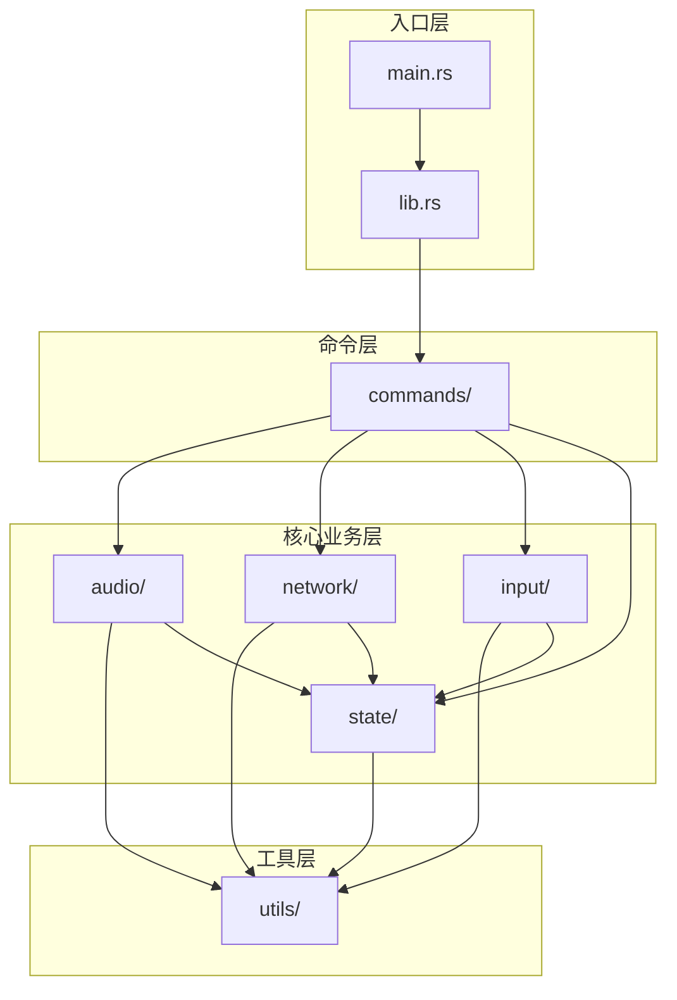

---

## 10. 依赖配置

### 10.1 Cargo.toml

```toml
[package]
name = "raflow"
version = "0.1.0"
edition = "2024"

[lib]
name = "raflow_lib"
crate-type = ["lib", "cdylib", "staticlib"]

[build-dependencies]
tauri-build = { version = "2.0", features = [] }

[dependencies]
# Tauri 核心
tauri = { version = "2.9", features = ["tray-icon", "protocol-asset"] }
tauri-plugin-global-shortcut = "2.3"
tauri-plugin-clipboard-manager = "2.3"
tauri-plugin-dialog = "2.2"
tauri-plugin-fs = "2.2"
tauri-plugin-shell = "2.2"

# 异步运行时
tokio = { version = "1.42", features = ["full"] }

# WebSocket
tokio-tungstenite = { version = "0.28", features = ["rustls-tls-native-roots"] }
futures-util = "0.3"

# 序列化
serde = { version = "1.0", features = ["derive"] }
serde_json = "1.0"

# 音频处理
cpal = "0.15"
rubato = "0.16"

# 编码
base64 = "0.22"

# 键盘模拟
enigo = "0.6"

# 窗口检测
x-win = "5.3"

# 状态管理
arc-swap = "1.7"

# 错误处理
thiserror = "2.0"
anyhow = "1.0"

# 日志
tracing = "0.1"
tracing-subscriber = { version = "0.3", features = ["env-filter"] }

# macOS 特定
[target.'cfg(target_os = "macos")'.dependencies]
macos-accessibility-client = "0.0.1"

# Windows 特定
[target.'cfg(target_os = "windows")'.dependencies]
windows = { version = "0.59", features = [
    "Win32_UI_Input_KeyboardAndMouse",
    "Win32_UI_WindowsAndMessaging"
]}
```

### 10.2 Capabilities 配置

```json
{
  "$schema": "../gen/schemas/desktop-schema.json",
  "identifier": "default",
  "description": "RaFlow default capabilities",
  "windows": ["main", "overlay"],
  "permissions": [
    "core:default",
    "core:window:allow-show",
    "core:window:allow-hide",
    "core:window:allow-set-focus",
    "core:window:allow-center",
    "global-shortcut:allow-register",
    "global-shortcut:allow-unregister",
    "global-shortcut:allow-is-registered",
    "clipboard-manager:allow-write-text",
    "clipboard-manager:allow-read-text",
    "dialog:allow-message",
    "dialog:allow-ask",
    "fs:allow-read-text-file",
    "fs:allow-write-text-file",
    "shell:allow-open"
  ]
}
```

---

## 11. 错误处理

### 11.1 错误类型层次

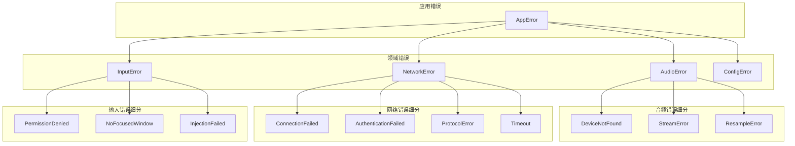

### 11.2 错误定义

```rust
use thiserror::Error;

#[derive(Error, Debug)]
pub enum AppError {
    #[error("Audio error: {0}")]
    Audio(#[from] AudioError),

    #[error("Network error: {0}")]
    Network(#[from] NetworkError),

    #[error("Input error: {0}")]
    Input(#[from] InputError),

    #[error("Configuration error: {0}")]
    Config(#[from] ConfigError),
}

#[derive(Error, Debug)]
pub enum AudioError {
    #[error("No audio input device found")]
    DeviceNotFound,

    #[error("Failed to build audio stream: {0}")]
    StreamBuildFailed(String),

    #[error("Audio stream error: {0}")]
    StreamError(String),

    #[error("Resampling failed: {0}")]
    ResampleFailed(String),
}

#[derive(Error, Debug)]
pub enum NetworkError {
    #[error("Failed to connect to server: {0}")]
    ConnectionFailed(String),

    #[error("Authentication failed: invalid API key")]
    AuthenticationFailed,

    #[error("Protocol error: {0}")]
    ProtocolError(String),

    #[error("Connection timeout after {0}ms")]
    Timeout(u64),

    #[error("WebSocket error: {0}")]
    WebSocket(#[from] tokio_tungstenite::tungstenite::Error),
}

#[derive(Error, Debug)]
pub enum InputError {
    #[error("Accessibility permission denied")]
    PermissionDenied,

    #[error("No focused window found")]
    NoFocusedWindow,

    #[error("Failed to inject text: {0}")]
    InjectionFailed(String),

    #[error("Clipboard operation failed: {0}")]
    ClipboardFailed(String),
}
```

---

## 12. 配置管理

### 12.1 配置结构

```rust
use arc_swap::ArcSwap;
use serde::{Deserialize, Serialize};
use std::sync::Arc;

/// 全局配置（使用 ArcSwap 实现无锁读取）
pub static CONFIG: once_cell::sync::Lazy<ArcSwap<AppConfig>> =
    once_cell::sync::Lazy::new(|| ArcSwap::new(Arc::new(AppConfig::default())));

#[derive(Debug, Clone, Serialize, Deserialize)]
pub struct AppConfig {
    /// API 配置
    pub api: ApiConfig,
    /// 音频配置
    pub audio: AudioSettings,
    /// 热键配置
    pub hotkeys: HotkeyConfig,
    /// 行为配置
    pub behavior: BehaviorConfig,
}

#[derive(Debug, Clone, Serialize, Deserialize)]
pub struct ApiConfig {
    /// ElevenLabs API Key
    pub api_key: String,
    /// 模型 ID
    pub model_id: String,  // "scribe_v2_realtime"
    /// 语言代码
    pub language_code: Option<String>,
}

#[derive(Debug, Clone, Serialize, Deserialize)]
pub struct AudioSettings {
    /// 输入设备 ID（None 表示默认设备）
    pub input_device: Option<String>,
    /// 是否启用降噪
    pub noise_reduction: bool,
    /// 音量增益 (0.5 - 2.0)
    pub gain: f32,
}

#[derive(Debug, Clone, Serialize, Deserialize)]
pub struct BehaviorConfig {
    /// 文本注入策略
    pub injection_strategy: InjectionStrategy,
    /// 自动提交间隔（秒）
    pub auto_commit_interval: u32,
    /// 是否显示悬浮窗
    pub show_overlay: bool,
}

#[derive(Debug, Clone, Serialize, Deserialize)]
pub enum InjectionStrategy {
    /// 自动选择（短文本用键盘，长文本用剪贴板）
    Auto,
    /// 始终使用键盘模拟
    Keyboard,
    /// 始终使用剪贴板粘贴
    Clipboard,
    /// 仅复制到剪贴板，不注入
    ClipboardOnly,
}
```

### 12.2 配置存储位置

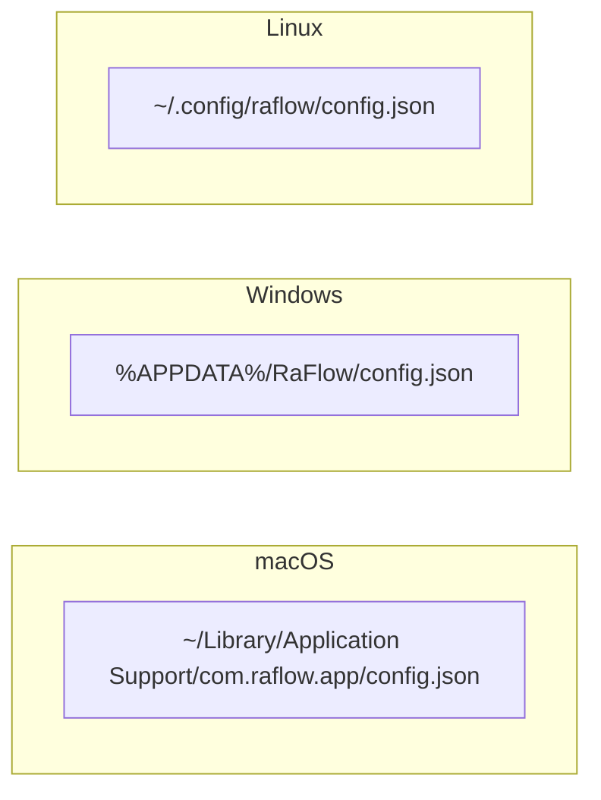

---

## 13. 性能优化策略

### 13.1 音频处理优化

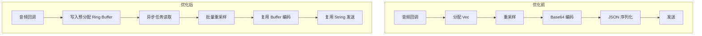

### 13.2 关键优化点

| 优化项 | 描述 | 预期收益 |
|--------|------|----------|
| Ring Buffer | 使用无锁环形缓冲区替代 mpsc channel | 减少内存分配 |
| 批量处理 | 累积 100ms 音频后批量处理 | 减少函数调用开销 |
| Buffer 复用 | 预分配 Base64 和 JSON buffer | 避免频繁分配 |
| SIMD 重采样 | rubato 自动使用 AVX/Neon | 3-5x 重采样性能 |
| 异步分离 | 音频采集与网络发送完全解耦 | 避免阻塞音频线程 |

---

## 14. 测试策略

### 14.1 测试层次

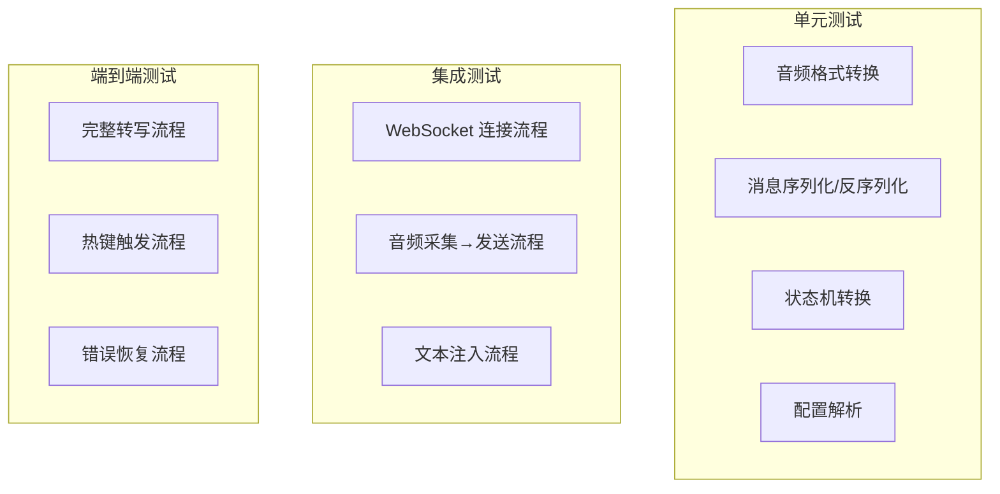

### 14.2 Mock 策略

```rust
/// WebSocket 服务端 Mock
pub struct MockScribeServer {
    responses: Vec<ServerMessage>,
}

impl MockScribeServer {
    pub fn new() -> Self {
        Self { responses: vec![] }
    }

    pub fn with_partial(mut self, text: &str) -> Self {
        self.responses.push(ServerMessage::PartialTranscript {
            text: text.to_string(),
        });
        self
    }

    pub fn with_committed(mut self, text: &str) -> Self {
        self.responses.push(ServerMessage::CommittedTranscript {
            text: text.to_string(),
        });
        self
    }
}
```

---

## 15. 部署与分发

### 15.1 构建流程

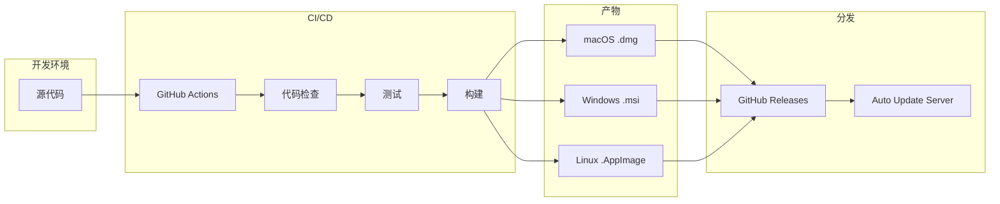

### 15.2 平台特定配置

| 平台 | 签名 | 公证 | 自动更新 |
|------|------|------|----------|
| macOS | Apple Developer ID | Apple Notarization | Sparkle |
| Windows | EV Code Signing | N/A | NSIS/WiX |
| Linux | N/A | N/A | AppImage |

---

## 16. 安全考虑

### 16.1 敏感数据处理

```mermaid
graph TB
    subgraph "API Key 安全"
        AK1[用户输入 API Key]
        AK2[加密存储到 Keychain/Credential Manager]
        AK3[运行时解密到内存]
        AK4[仅通过 HTTPS/WSS 传输]

        AK1 --> AK2 --> AK3 --> AK4
    end

    subgraph "音频数据安全"
        AD1[音频数据仅在内存中]
        AD2[不持久化到磁盘]
        AD3[会话结束后清除]
    end

    subgraph "转写数据安全"
        TD1[转写结果不缓存]
        TD2[注入后立即清除]
    end
```

### 16.2 权限最小化

- 仅请求必要的系统权限
- macOS：辅助功能权限（用于键盘模拟）
- macOS：麦克风权限（用于音频采集）
- 不请求屏幕录制权限（除非需要窗口标题）

---

## 17. 参考资料

### 17.1 官方文档

- [Tauri v2 Documentation](https://v2.tauri.app/)
- [ElevenLabs Scribe API](https://elevenlabs.io/docs/api-reference/speech-to-text/v-1-speech-to-text-realtime)
- [cpal Documentation](https://docs.rs/cpal/latest/cpal/)
- [tokio-tungstenite Documentation](https://docs.rs/tokio-tungstenite/latest/tokio_tungstenite/)

### 17.2 相关 Crates

- [rubato - Audio Resampling](https://crates.io/crates/rubato)
- [enigo - Cross-platform Input Simulation](https://crates.io/crates/enigo)
- [x-win - Window Detection](https://crates.io/crates/x-win)
- [macos-accessibility-client](https://crates.io/crates/macos-accessibility-client)

---

*文档版本: 1.0.0*
*最后更新: 2025-12-21*
